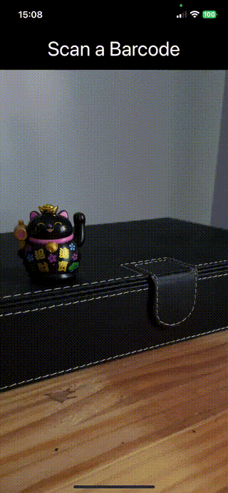

# Barcode Scanner Sample Project

Welcome to the **Barcode Scanner Sample Project**! 📱 This repository provides a simple, easy-to-implement iOS application that demonstrates how to scan barcodes. It's designed to be a starting point for developers interested in integrating barcode scanning functionality into their own projects.

---

## 🚀 Features

- **Fast Barcode Scanning**: Quickly and efficiently scan barcodes using your device's camera.
- **Wide Barcode Support**: Supports a variety of barcode formats, including QR codes, UPC, and more.
- **Clean, Minimal UI**: Designed with simplicity in mind for quick integration and customization.

---

## 🎥 Demo Video

Check out the app in action!  
  

Alternatively, you can preview the video directly below:  

---

## 🛠️ How to Run the Project

### Prerequisites

1. XCode 16.0
2. iOS real device (iPhone or iPad).

### Installation

1. Clone the repository:

   ```bash
   git clone https://github.com/JaCaLla/BarCodeScanner.git 
   cd BarCodeScanner
   xed .
   Build and Run


